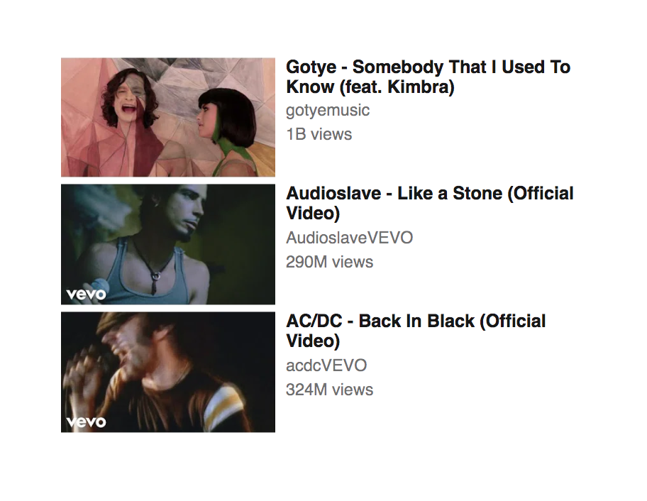

# YouTube Thumbnails

## Steps

1. Fork this [pen](https://codepen.io/agzeri/pen/aqwjLM).
2. Configure `Sass` as pre-processor.
3. Fix all elements and use only `classes` with `Sass` variables and nesting.

## Recommendations

- Use `outline: 1px solid red` to test element and debug better the User Interface.

- Replace all complex selectors to only classes.

## Deliverables

- A GitHub repo called `activity--youtube-thumbnails` on your GitHub profile.
- That GitHub repo link to Trello Card, **Week 2, Day 2 – Tuesday**.

## Final Result

